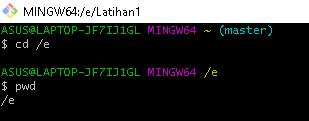
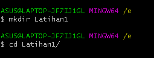
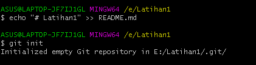
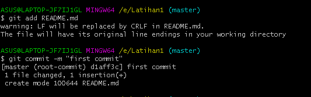
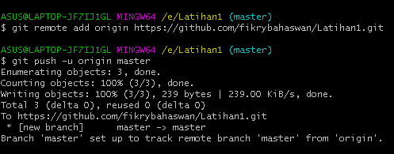
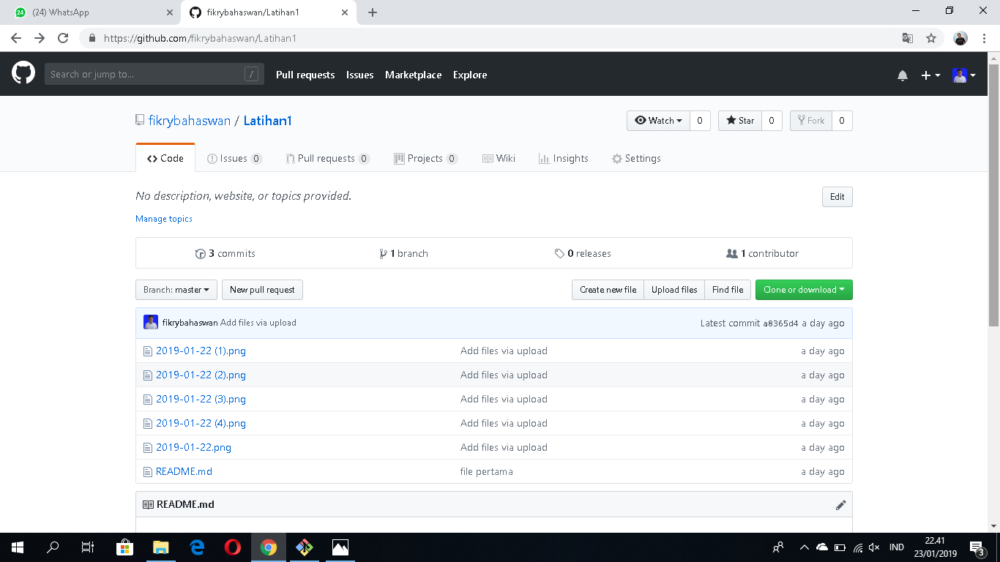

# Tutorial Penggunaan Git <h1

# Perintah Dasar Git <h2>
* _**git init**_, perintah untuk membuat repository local
* _**git add**_, perintah untuk menambahkan file baru, atau perubahan
pada file pada staging sebelum proses commit. 
* _**git commit**_, perintah untuk menyimpan perubahan kedalam database git. 
* _**git push -u origin master**_, perintah untuk mengirim perubahan pada repository 
local menuju server repository. 
* _**git clone [url]**_, perintah untuk membuat working directory yang diambil dari 
repositry sever.
* _**git remote add origin [url]**_, perintah untuk menambahkan remote 
server/reopsitory server pada local repositry (working directory)

# Membuat Reposiory Local <h2>
* Buka direktory aktif, misal: e:/Latihan1
* Buat direktory project praktikum pertama dengan nama Latihan1
* Sehingga terbentuk satu direktori baru dibawahnya, selanjutnya masuk kedalam direktori tersebut dengan perintah cd (change
directory)
* direktory aktif menjadi: e:/Latihan1 
* Pindah direktory ke e , kemudian "pwd" untuk memasukkan username dan password saat push 
#  <h2>
* Lakukan "mkdir Latihan1" untuk membuat repository kemudian masuk ke directory nya
#  <h2>
* Lakukan "git init" untuk membuat hidden file git
#  <h2>
* kemudian tambahkan file tersebut ke repository dengan " git add 
README.md, setelah melakukan perubahan lakukan "git commit -m (first commit)" 
#  <h2>
* Lakukan "Git remote add" untuk meremote repository online dan upload hasil revisi ke Repository online dan Push menggunakan "git push -u Origin master"
# 
# Membuat repository server <h2>
* Server reopsitory yang akan kita gunakan adalah http://github.com
* Anda harus membuat akun terlebih dahulu. • Pada laman github, klik tombol start a project, atau
* Dari menu (icon +) klik New Repository
#  
 
# Melihat hasilnya pada server repository <h2>
* Buka laman github.com, arahkan pada repositori- nya. 
* Maka perubahan akan terlihat pada laman tersebut. 
# 
